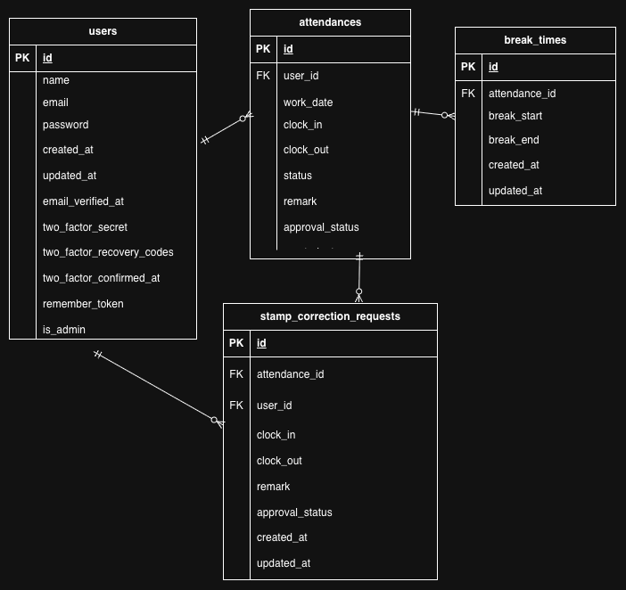

# 勤怠管理アプリ

スタッフの出退勤・休憩時間を記録し、勤怠情報を管理するためのアプリケーションです。

## 環境構築

### Dockerビルド

1. リポジトリをクローン
2. Dockerコンテナを作成・起動

```bash
docker-compose up -d --build
```

### Laravel環境構築

1. PHPコンテナに入る

```bash
docker-compose exec php bash
```

2. Composerパッケージをインストール

```bash
composer install
```

3. `.env.example` をコピーして `.env` を作成

```bash
cp .env.example .env
```

4. `.env` のデータベース設定を環境に合わせて変更

```text
DB_CONNECTION=mysql
DB_HOST=mysql
DB_PORT=3306
DB_DATABASE=laravel_db
DB_USERNAME=laravel_user
DB_PASSWORD=laravel_pass
```

5. アプリケーションキーを生成

```bash
php artisan key:generate
```

6. マイグレーションとシーディングを実行

```bash
php artisan migrate --seed
```

## 使用技術（実行環境）

- PHP 8.1.34
- Laravel 10.50.2
- MySQL 8.0.26
- Docker / Docker Compose

## ログイン情報

### 一般ユーザー1

- メールアドレス：user1@example.com
- パスワード：password

### 一般ユーザー2

- メールアドレス：user2@example.com
- パスワード：password

### 管理者ユーザー

- メールアドレス：user3@example.com
- パスワード：password

## ER図



## URL

- 開発環境：http://localhost:8080/
- phpMyAdmin：http://localhost:8081/
